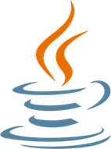

# Welcome to Java Bootcamp 2019!

## Introduction
Hi! get ready to jump from Java Core to **REST and backend things**. This bootcamp will give you some important concepts and tools in order to get ready for a job, the only precondition is that you will need some git and java core knowledge.

But what exactly I need to complete this without blow my mind?. The response is: to know how to write java classes, the common things (loops, collections, blah) and how to use git as beginner level, it means fork, branching, push, pull request and the most important thing.. want to be a backend developer!

If you don't have the pre requisites you always can ramp it up quickly using:

Java Standard Edition:
- [Getting Started](https://docs.oracle.com/javase/tutorial/getStarted/index.html)
- [Java Language](https://docs.oracle.com/javase/tutorial/java/index.html)
- [Essential Java Classes](https://docs.oracle.com/javase/tutorial/essential/index.html)
- [Collections](https://docs.oracle.com/javase/tutorial/collections/index.html)
- [Github Essentials](https://guides.github.com/activities/hello-world/)

In order to be in touch we will use a slack channel. **THIS IS NOT A TALENT CONTEST IS A COLLABORATIVE SPACE** please use the communication channels to keep in touch, show progress, responds to others, make jokes and share cool memes!. We'll provide a slack channel we the bootcamp starts.

If you are not familiar with slack you can install and learn about it very quickly with this [link](https://get.slack.help/hc/en-us/articles/218080037-Getting-started-for-new-members).

So.. are you ready for a very focused and quick learning???

## Bootcamp Objective & Organization
The main objective of this bootcamp is bring people from java and programming basis knowledge to backend development. To be a backend developer implies a lot of things a maybe years of expertise to reach a senior level but do not panic, we will just give you a quick and focused knowledge in order to write a REST API that expose a set of features to the world. This API will persists data in a database using an ORM and will expose API specs using a API documentation framework.

But.. what a **** is an API?, don't worry, we will cover a lot of things in the middle.

In order to have a sort of guide we will divide the bootcamp in 3 weeks and each one could have 1 or more topics. Our expectations is that you may spend up to 4 hours a day depends on your previous knowledge and your slack participation.

We will provide you some tutors in order to guide you and respond specific questions, but remember **this is a self training and your effort and communication really matters**. We will be here to answer questions and give you tips.

Our recommendations to be successful on this bootcamp are:

>- Make a routine, that will help you to finish the bootcamp
>- Participate on the slack channels
>- Don't be afraid to ask or more important.. to answer others
>- Test and tray all.. just reading is not enough
>- Keep positive and do your best.. remember is just 3 weeks
>- If tutors give you the chance to assist to a Q&A session, assist even you have nothing pending!!!

## About the Authors

>[Luis Sala Espiell](https://www.linkedin.com/in/luis-manuel-sala-espiell-19079330/)

>[Gonzalo San Martin](https://www.linkedin.com/in/gonsanmartin/)

>[Juan Pablo Pizarro](https://www.linkedin.com/in/juanpablopizarro/)

## First week: The Mission.. REST
Grab a coffee cup and let's start!! ([pre requisites](./prerequisites.md))

### What a hell is a service and even worst.. an API!
Service according to W3C:
> Service is a software system designed to support interoperable machine-to-machine interaction over a network

And Application Program Interface (API) according wikipedia:
>In computer programming an **application programming interface** (**API**) is a set of subroutine definitions, communication protocols, and tools for building software. In general terms, it is a set of clearly defined methods of communication among various components. A good API makes it easier to develop a computer program by providing all the building blocks, which are then put together by the programmer.

We will define API and implement them using REST. According stackoverflow:
> **REST** stands for Representational State Transfer. (It is sometimes spelled "**ReST**".) It relies on a stateless, client-server, cacheable communications protocol -- and in virtually all cases, the **HTTP** protocol is used.**REST** is an architecture style for designing networked applications.

Too many definition does't it, let's put it all together. Service is basically a lot of software artifacts that give a feature or set of them to the final user. We will define the service using an API and we will use REST architecture over HTTP protocol. To these services that implements the REST architecture we will called them as RESTful.

Let's the game begin.. 

[Playing with REST!!](./rest.md)

## Second week: This is all about Persistence!

### So.. what does persistence mean ?
According to Wikipedia:
> In computer science, persistence refers to the characteristic of state that outlives the process that created it. This is achieved in practice by storing the state as data in computer data storage. Programs have to transfer data to and from storage devices and have to provide mappings from the native programming-language data structures to the storage device data structures.
### How can this be achieved on Java ?
The previous definition is too broad. In java there are plenty of technologies to achieve data persistence. We could classify most of them into two big categories: Relational Databases (SQ ) and Non-Relational Databases (NoSQL)

- [Relational databases](https://en.wikipedia.org/wiki/Relational_database)

- [Non relational databases](https://en.wikipedia.org/wiki/NoSQL)

In this bootcamp we are going to focus on Relational databases, so let's get started..

[Playing with Data Persistence!!](./data.md)

## Third week: If you don't want to suffer.. best practices 

Now is time to get sorted all the concepts and enclose in a quality framework. We will dive into some good practices and techniques in order to add quality and follow common patterns to create scalable, flexible and easy to follow software.

In the enterprise level the good practices is a big deal because it save a lot of time solving common issues like logging and metrics. Spring and Spring Boot follows some good patterns and they are flexible to be extended. The last years micro services became very popular and almost every developer in the world hear about it but it doesn't mean that all the developers are architects or experts on micro services. If you researched about micro services you may note that in order to create and maintain a micro service architecture you need some extra things like to know about cloud computing, infrastructure and scalability. We will see a preview later just to get the dimension on the complexity in the real world.

In a far away galaxy.. or not, we have new players like kubernetes and docker. Kubernetes is an open-source system for automating deployment, scaling and management of containerized applications. Docker is a tool designed to make it easier to create, deploy, and run applications by using containers. Containers allow a developer to package up an application with all of the parts it needs, such as libraries and other dependencies, and ship it all out as one package. Having said that, we will focused on good practices in order to create software to run in modern solutions like docker and kubernetes on the cloud.

Just for curiousness:
- [Docker](https://www.docker.com/)
- [Kubernetes](https://kubernetes.io/)

**Disclaimer**: we will not cover Docker or Kubernetes, is just an example why we have to write using good practices.

As always, to do things in the correct way will save a ton of headache.. so lets work with good practices from scratch.

[Final Reading!](./goodpractices.md)

## Some final words..

In the last weeks we have seen how to develop a simple web application with some of the most commonly used technologies nowadays, but this is just the beginning. During your career path you will face many different languages/technologies that you will have to learn and to apply. 

Also as technology continues to grow by leaps and bounds, the software development is scaling right along with it and new trends appear like Artificial Intelligence (AI), Blockchain Technology, etc..

So our big advice is to keep learning and keep your skills sharp!

